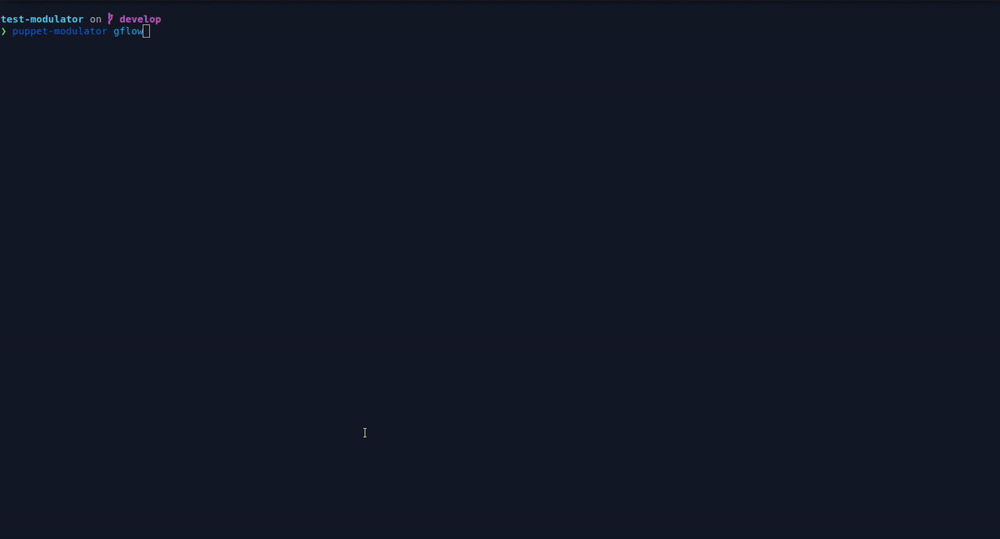

# Puppet Modulator

[](https://gitlab.in2p3.fr/cc-in2p3-puppet-master-tools/puppet-modulator/-/commits/develop)
[](https://gitlab.in2p3.fr/cc-in2p3-puppet-master-tools/puppet-modulator/-/commits/develop)

- [Puppet Modulator](#puppet-modulator)
  - [Description](#description)
  - [Usage](#usage)
    - [Pro tip: set an alias](#pro-tip-set-an-alias)
    - [Git-flow wrappers](#git-flow-wrappers)
      - [Hotfix](#hotfix)
      - [Release](#release)
    - [Metadata manipulation](#metadata-manipulation)
      - [Bump versions](#bump-versions)
  - [Install](#install)
  - [Git flow subcommands](#git-flow-subcommands)
    - [Release and Hotfix version auto-guess](#release-and-hotfix-version-auto-guess)
  - [Examples](#examples)
    - [Metadata manipulation](#metadata-manipulation-1)
      - [Bump version without auto commit](#bump-version-without-auto-commit)
      - [Bump version with auto commit](#bump-version-with-auto-commit)
    - [Git flow release](#git-flow-release)
      - [Start and finish a git-flow release](#start-and-finish-a-git-flow-release)
  - [TODO](#todo)
    - [Git flow](#git-flow)
    - [Metadata](#metadata)

## Description

High level wrapper that allows to:
* quickly edit `metadata.json` version field
* wrap `git-flow` with common Puppet module edition workflows

## Usage

```
❯ puppet-modulator -h
Usage:
  puppet-modulator [command]

Available Commands:
  completion  generate the autocompletion script for the specified shell
  flow       A git-flow high-level wrapper for hotfixes and releases
  help        Help about any command
  metadata    Manipulate module metadata.json file
  version     Display software version and exit

Flags:
      --config string   config file (default is $HOME/.puppet-modulator.yaml)
  -d, --debug           Enable debug
  -h, --help            help for puppet-modulator

Use "puppet-modulator [command] --help" for more information about a command.
```

### Pro tip: set an alias

If `puppet-modulator` is too long for you to type, just set an alias such as `alias pm="puppet-modulator"` and all the commands will become

```
$ pm flow hotfix start
```

and so on

### Git-flow wrappers

#### Hotfix

```
❯ puppet-modulator flow hotfix -h
A git-flow high-level wrapper for hotfixes

Usage:
  puppet-modulator gflow hotfix [command]

Available Commands:
  finish      A git-flow high-level wrapper to finish hotfixes
  start       A git-flow high-level wrapper to start hotfixes

Flags:
  -h, --help   help for hotfix

Global Flags:
      --config string   config file (default is $HOME/.puppet-modulator.yaml)
  -d, --debug           Enable debug

Use "puppet-modulator flow hotfix [command] --help" for more information about a command.
```

#### Release

```
❯ puppet-modulator flow release -h
A git-flow high-level wrapper for releases

Usage:
  puppet-modulator gflow release [command]

Available Commands:
  finish      A git-flow high-level wrapper to finish releases
  start       A git-flow high-level wrapper to start releases

Flags:
  -h, --help   help for release

Global Flags:
      --config string   config file (default is $HOME/.puppet-modulator.yaml)
  -d, --debug           Enable debug

Use "puppet-modulator flow release [command] --help" for more information about a command.
```

### Metadata manipulation

#### Bump versions

```
❯ puppet-modulator metadata -h
Manipulate module metadata.json file

Usage:
  puppet-modulator metadata [command]

Available Commands:
  bump
  set-version Set exact module version

Flags:
  -g, --git-commit                       Commit changes to git
  -m, --git-commit-msg string            Git commit message (default "[meta] Bump version")
  -h, --help                             help for metadata
  -p, --keys-sort-commit-policy string   policy related to metadata keys sort commit. If pre-commit is used, then a dedicated commit will be created dedicated to metadata keys sorting. If no-pre-commit is used, metadata keys sorting will still occurs, but no dedicated commit will be created (default "pre-commit")
  -o, --output string                    Where to write metadata to. Defaults to modify metadata in-place

Global Flags:
      --config string   config file (default is $HOME/.puppet-modulator.yaml)
  -d, --debug           Enable debug

Use "puppet-modulator metadata [command] --help" for more information about a command.
```

## Install

Pre-compiled binaries are available in the [release page](https://gitlab.in2p3.fr/cc-in2p3-puppet-master-tools/puppet-modulator/-/releases).

## Git flow subcommands

### Release and Hotfix version auto-guess

If you do not specify a version in your `puppet-modulator flow hotfix start` or `puppet-modulator flow release start` command, `puppet-modulator` will admit that you're trying to work _quickly_ and use the most common _version bump logic_ for those operations.

This mean that:
* for a `hotfix`, it will _increment the patch version_
* for a `release`, it will _increment the minor version_

**Important**:
* If you don't want to use the _version auto-guess_ feature, you'll have to explicitly specify a version on command-line.
* If you want to specify a `base reference` branch and still use the _auto-guess_ feature, you can use `""` (empty string) for the version, or `?` (question mark).

## Examples

### Metadata manipulation

#### Bump version without auto commit


#### Bump version with auto commit


### Git flow release

#### Start and finish a git-flow release



## TODO

### Git flow

* [ ] Add a _subcommand_ or _flag_ to allow for _flash releases_ that would allow developer to _start_, _commit_, _finish_ a release with only one command

### Metadata

* [ ] Add command to add a module _dependency_ (with SemVer range validation / helpers)
* [ ] Add command to allow _puppet requirements_ manipulation
