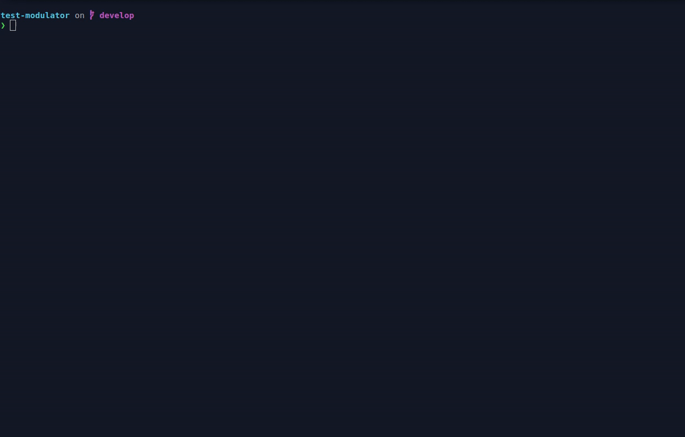
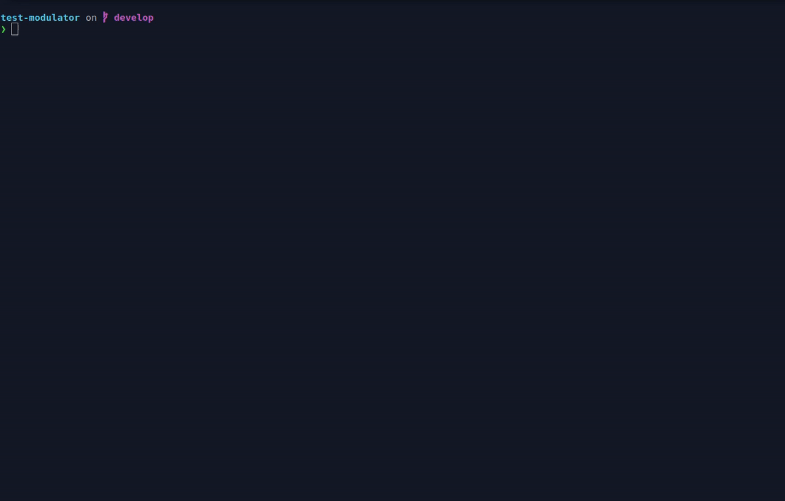

# Puppet Modulator

## Description

High level wrapper that allows to:
* quickly edit `metadata.json` version field
* wrap `git-flow` with common Puppet module edition workflows

## Usage

```
❯ puppet-modulator -h
Usage:
  puppet-modulator [command]

Available Commands:
  completion  generate the autocompletion script for the specified shell
  gflow       A git-flow high-level wrapper for hotfixes and releases
  help        Help about any command
  metadata    Manipulate module metadata.json file
  version     Display software version and exit

Flags:
      --config string   config file (default is $HOME/.puppet-modulator.yaml)
  -d, --debug           Enable debug
  -h, --help            help for puppet-modulator

Use "puppet-modulator [command] --help" for more information about a command.
```

### Git-flow wrappers

#### Hotfix

```
❯ puppet-modulator gflow hotfix -h
A git-flow high-level wrapper for hotfixes

Usage:
  puppet-modulator gflow hotfix [command]

Available Commands:
  finish      A git-flow high-level wrapper to finish hotfixes
  start       A git-flow high-level wrapper to start hotfixes

Flags:
  -h, --help   help for hotfix

Global Flags:
      --config string   config file (default is $HOME/.puppet-modulator.yaml)
  -d, --debug           Enable debug

Use "puppet-modulator gflow hotfix [command] --help" for more information about a command.
```

#### Release

```
❯ puppet-modulator gflow release -h
A git-flow high-level wrapper for releases

Usage:
  puppet-modulator gflow release [command]

Available Commands:
  finish      A git-flow high-level wrapper to finish releases
  start       A git-flow high-level wrapper to start releases

Flags:
  -h, --help   help for release

Global Flags:
      --config string   config file (default is $HOME/.puppet-modulator.yaml)
  -d, --debug           Enable debug

Use "puppet-modulator gflow release [command] --help" for more information about a command.
```

### Metadata manipulation

#### Bump versions

```
❯ puppet-modulator metadata -h
Manipulate module metadata.json file

Usage:
  puppet-modulator metadata [command]

Available Commands:
  bump
  set-version Set exact module version

Flags:
  -g, --git-commit                       Commit changes to git
  -m, --git-commit-msg string            Git commit message (default "[meta] Bump version")
  -h, --help                             help for metadata
  -p, --keys-sort-commit-policy string   policy related to metadata keys sort commit. If pre-commit is used, then a dedicated commit will be created dedicated to metadata keys sorting. If no-pre-commit is used, metadata keys sorting will still occurs, but no dedicated commit will be created (default "pre-commit")
  -o, --output string                    Where to write metadata to. Defaults to modify metadata in-place

Global Flags:
      --config string   config file (default is $HOME/.puppet-modulator.yaml)
  -d, --debug           Enable debug

Use "puppet-modulator metadata [command] --help" for more information about a command.
```

## Examples

### Metadata manipulation

#### Bump version without auto commit



#### Bump version with auto commit



### Git flow release

#### Start and finish a git-flow release


