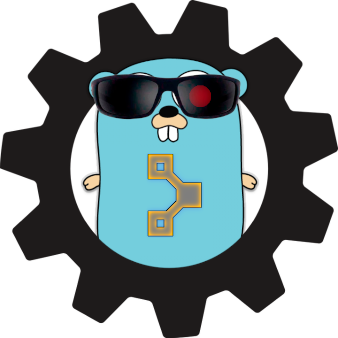

# Puppet Modulator



## Description

`puppet-modulator` (or `modulator` or `pm`) is a high level wrapper that allows to:

* quickly edit your module `metadata.json` content
* wrap `git-flow` with common Puppet module edition workflows

<br/>

It has been heavily inspired by the awesome [puppet blacksmith](https://github.com/voxpupuli/puppet-blacksmith).

Compared to `blacksmith`, `modulator` comes as a standalone tool written in Go.
Hence, it does not depend on the module you're currently editing or on any Ruby / gem version or whatsoever.

## Usage

```
❯ pm help
Usage:
  puppet-modulator [command]

Available Commands:
  completion  generate the autocompletion script for the specified shell
  flow        A git-flow high-level wrapper for hotfixes and releases
  help        Help about any command
  metadata    Manipulate module metadata.json file
  version     Display software version and exit

Flags:
      --config string   config file (default is $HOME/.puppet-modulator.yaml)
  -d, --debug           Enable debug
  -h, --help            help for puppet-modulator

Use "puppet-modulator [command] --help" for more information about a command.
```